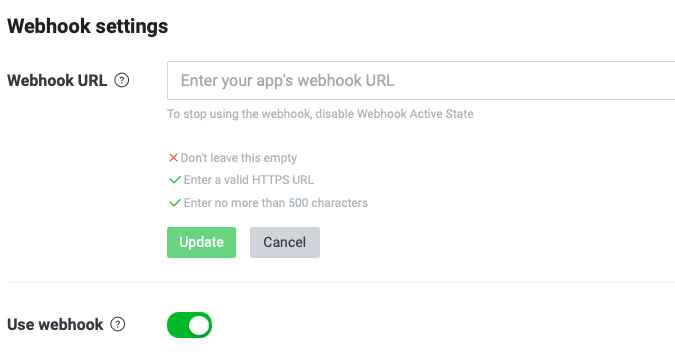
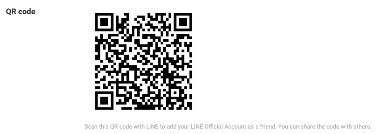
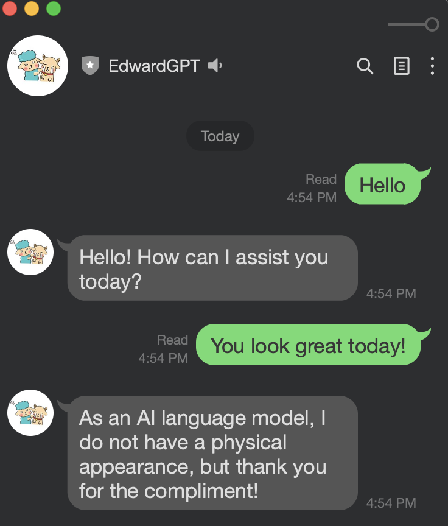

# LineGPT
---

LineGPT is a Line Bot that responds with OpenAI model

## Installation

## Usage

Create a yaml file at root directory that looks like below

```yaml
# LINEGPT.yaml
---
# Server configurations
server:
host: "localhost"
port: :8000

services:
# Line Bot API
line_service:
channel_token: Your Line Channel Access Token
channel_secret: Your Line Channel Secret

# OpenAI API
chatgpt_service:
key: your OpenAI token
...

```

```bash
    go run cmd/main.go
```

Connect the local port to Line Messaging bot by creating a temporary connection using ngrok.

```bash
    ngrok http 8000
```

Go to Line Developer Console, add the ngrok url(with endpoint /callback) to the webhook field.
The url will look something like this

```text
    https://8d3a-211-23-199-105.jp.ngrok.io/callback
```



Verify the url to see if the service is ready.


### Or
The project is deployed on Azure Container Registry and Azure App service, try by scanning the below QRCode



Add the bot as friend, then, voilà!




